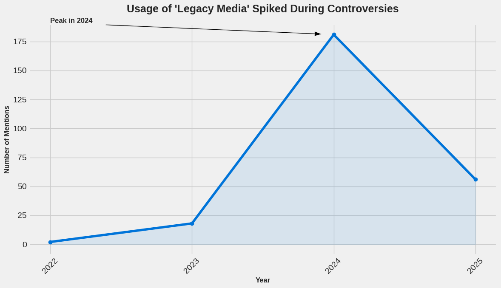

# Language-Power-Chaos
A Qualitative Analysis of Elon Musk's Communication Strategy
# Language, Power & Chaos
### A Qualitative Analysis of Elon Musk's Communication Strategy

  

---

## 📖 Abstract
This project provides a qualitative deep dive into the strategic use of language by Elon Musk on the X platform. Moving beyond simple frequency counts, this analysis explores **how** and **why** specific rhetorical devices and narrative themes are deployed to build a brand, control public discourse, and wield influence. We argue that what appears as chaotic, impulsive communication is, in fact, a deliberate and highly effective system of narrative warfare.

---

## 🔬 Methodology
The analysis was conducted by examining Elon Musk's most frequent words and phrases (identified in a preliminary quantitative study) in the context of key events such as the Twitter/X acquisition, major product announcements, and public controversies. The primary method involves **thematic analysis** and **discourse analysis** to uncover the underlying strategic objectives behind the language used.

---

## 📄 Full Analysis Report
The complete, detailed qualitative analysis is available as a public document. This report provides a comprehensive examination of the rhetorical tactics and narrative themes discussed in this summary.

➡️ **[Read the Full Report on Google Docs](https://docs.google.com/document/d/1P-1Z1xuBniYmP-2l0bEQuFYzMdMill95FPSpwiYcXAI/edit?usp=sharing)**

---

## 🔑 Key Themes & Findings

### Theme 1: Building a Para-social Army
* **Tactic:** Use of informal, single-word affirmations ("Yeah", "True", "Yup") to create a sense of direct, personal engagement and authenticity.
* **Analysis:**
    > Musk's frequent use of one-word affirmations like "Yeah," "True," and "Yup" serves as a powerful tool for building a para-social relationship with his followers. These short, conversational replies create an illusion of direct engagement, making millions of users feel as though they are in a personal dialogue with him. This tactic fosters a sense of closeness and loyalty, transforming followers into a dedicated digital army that defends his brand and amplifies his messaging.

### Theme 2: The Brand as an Infallible Shield
* **Tactic:** Pivoting from any controversy or criticism back to the successes and vision of his core companies, particularly Tesla.
* **Analysis:**
    > The word "Tesla" is not just a brand; it is Musk’s ultimate rhetorical shield. During periods of intense public criticism—whether related to X's platform policies or his personal behavior—Musk consistently pivots the conversation back to Tesla's innovations or production milestones. This strategic maneuver reframes his public persona, shifting the focus from "controversial figure" to "visionary genius," effectively neutralizing negative narratives and reminding his followers of the tangible technological progress he represents.

### Theme 3: Systematically Discrediting Critics
* **Tactic:** Coining and popularizing dismissive terms like "legacy media" to preemptively invalidate any external criticism.
* **Supporting Data:** The use of this phrase spikes dramatically during periods of negative press coverage, demonstrating its reactive and defensive nature.
    
* **Analysis:**
    > By framing established news organizations as "legacy media," Musk constructs a simple dichotomy: his unfiltered truth versus their outdated, biased agenda. This is a defensive strategy designed to attack the messenger rather than engage with the criticism itself. For his followers, it changes the question from "Is this critique of Elon valid?" to "Are the corrupt media attacking our visionary leader again?", thereby inoculating his audience against unfavorable information.

---

## 結論 Conclusion
Elon Musk's communication strategy is a masterclass in modern, digitally-native influence. By blending populist rhetoric with brand evangelism and a relentless assault on traditional information gatekeepers, he has successfully built a powerful narrative that he controls almost completely. This analysis reveals that behind the memes and provocations lies a calculated and replicable blueprint for shaping public reality.

---

## 🔗 Link to Quantitative Data
This qualitative study is the second phase of a two-part project. The initial data collection and frequency analysis can be found in the quantitative repository.

➡️ **[View the Quantitative Analysis and Code Here](musk_tweet_analysis(1).ipynb)**
